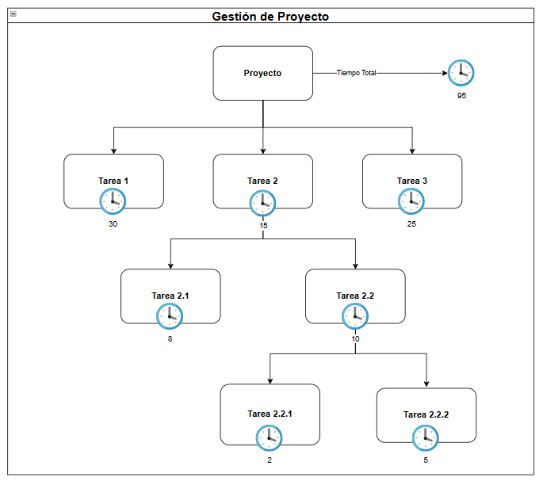
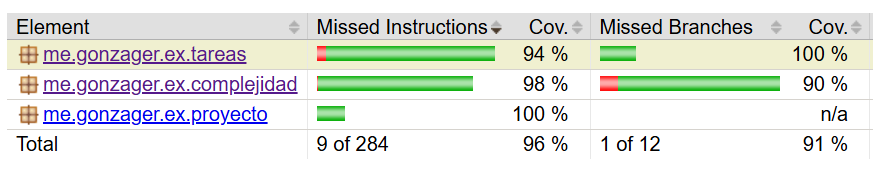

# Gestión de Proyectos

Los proyectos se componen de tareas y las tareas de subtareas, que a su vez, las subtareas pueden tener otras subtareas. Cada una de estas tareas y subtareas tiene un tiempo estimado de duración en días.


El costo en dinero de una tarea es igual al tiempo de la tarea multiplicado por un valor común y configurable para todas las complejidades. Además cada complejidad puede agregarle un porcentaje extra que se suma al costo.

- Complejidad mínima: no agrega porcentaje extra.
- Complejidad media: agrega un 5% extra
- Complejidad máxima:
  - Si el tiempo es menor o igual a 10 unidades entonces agrega un extra del 7%
  - Si el tiempo es mayor a 10 unidades entonces agrega un extra del 7% más $1000 por cada día que la tarea exceda las 10 unidades.

A su vez las tareas que tengan más de 3 subtareas directas asociadas tienen un costo extra del 4% por overhead.

**Importante**: Para calcular el costo de una tarea sólo se utiliza el tiempo específico de la misma. Por ejemplo para calcular el costo de la tarea 2, el tiempo es a utilizar es 15 y no 40 (que sería sumando todas las subareas anidadas)

## Requerimientos a resolver

- Determinar la duración total de una tarea simple y compleja.
- Determinar la duración total del proyecto que incluya tareas simples y complejas.
- Determinar el costo de una tarea.
- Determinar el costo total del proyecto
- Realizar todos los test siguiendo la siguiente estructura de proyecto.

### Estructura para los Test

```shell
└── Proyecto
    ├── Tarea 1                 #Duración: 30 - Complejidad: Media
        ├── Tarea 1.1           #Duración:  4 - Complejidad: Mínima
        ├── Tarea 1.2           #Duración:  3 - Complejidad: Mínima
        ├── Tarea 1.3           #Duración: 16 - Complejidad: Máxima
        ├── Tarea 1.4           #Duración: 14 - Complejidad: Media

    └── Tarea 2                 #Duración: 15 - Complejidad: Máxima
        ├── Tarea 2.1           #Duración: 8 - Complejidad: Media
        ├── Tarea 2.2           #Duración: 10 - Complejidad: Máxima
            ├── Tarea 2.2.1     #Duración:  2 - Complejidad: Mínima
            ├── Tarea 2.2.2     #Duración:  5 - Complejidad: Máxima

    └── Tarea 3                 #Duración: 20 - Complejidad: Mínima
        ├── Tarea 3.1           #Duración: 12 - Complejidad: Media
        ├── Tarea 3.2           #Duración:  8 - Complejidad: Mínima
```

Ejemplo: Si el valor común y configurable para todas las Complejidades se fijar en $ 2500, entonces

| Tarea | Complejidad | Costo | Duración | Duración Total |
| ----- | ----------- | ----- | -------- | -------------- |
| 1     | media       | 81900 | 30       | 67             |
| 1.1   | mínima      | 10000 | 4        | 4              |
| 1.2   | mínima      | 7500  | 3        | 3              |
| 1.3   | máxima      | 48800 | 16       | 16             |
| 1.4   | media       | 36750 | 14       | 14             |
| 2     | máxima      | 45125 | 15       | 40             |
| 2.1   | media       | 21000 | 8        | 8              |
| 2.2   | máxima      | 26750 | 10       | 17             |
| 2.2.1 | mínima      | 5000  | 2        | 2              |
| 2.2.2 | máxima      | 13375 | 5        | 5              |
| 3     | mínima      | 50000 | 20       | 40             |
| 3.1   | media       | 31500 | 12       | 12             |
| 3.2   | mínima      | 20000 | 8        | 8              |

El costo total del proyecto es: $ 397700

## Nuevo Requerimiento

Nos llega un nuevo requerimiento que nos indica que un proyecto puede ser reevaluado, lo que implica revisar y cambiar las complejidades de las tareas de acuerdo a las siguientes reglas.

- Una tarea de complejidad mínima pasa a complejidad media si la duración de la tarea es de más de 15 unidades.
- Una tarea de complejidad media pasa a complejidad máxima si la duración de la tarea es de más de 25 unidades y tiene más de 3 subtareas dependientes en forma directa.
- Una tarea de complejidad máxima pasa a complejidad media si su costo es menor a $ 15000

### Test de reevaluación

- Realizar el test de reevaluación de un proyecto.

Si tomamos la misma configuración del proyecto de los test anteriores y realizamos la reevaluación el resultado debería ser el siguiente:
|Cambio| Tarea | Complejidad | Costo | Duración | Duración Total |
|------| ----- | ----------- | ----- | -------- | -------------- |
|SI | 1 | máxima | 104260| 30 | 67 |
|NO| 1.1 | mínima | 10000 | 4 | 4 |
|NO| 1.2 | mínima | 7500 | 3 | 3 |
|NO| 1.3 | máxima | 48800 | 16 | 16 |
|NO| 1.4 | media | 36750 | 14 | 14 |
|NO| 2 | máxima | 45125 | 15 | 40 |
|NO| 2.1 | media | 21000 | 8 | 8 |
|NO| 2.2 | máxima | 26750 | 10 | 17 |
|NO| 2.2.1 | mínima | 5000 | 2 | 2 |
|SI| 2.2.2 | media | 13125 | 5 | 5 |
|SI| 3 | media | 52500 | 20 | 40 |
|NO| 3.1 | media | 31500 | 12 | 12 |
|NO| 3.2 | mínima | 20000 | 8 | 8 |

## Recomendaciones y tareas adicionales

- Utilizar el concepto de polimorfismo en las situaciones que sean aplicables. Por ejemplo es correcto hacer algo así:

```
public abstract class Tarea {
    .....
    public Boolean esTareaSimple() {
        return this instanceof TareaSimple
    }
}

public class TareaSimple {
    .....
}

```

- Enumerar los patrones de diseño utilizados.
- Armar un diagrama de clase simple que refleje las ideas del diseño implementado.
- Hay algunos objetos de las cuales solo necesitamos única instancia. ¿Cuáles? y ¿Por Qué? y ¿Cómo sería?
- Coverage: es obligatorio tener más de un 85% de coverage. Ejemplo
  
